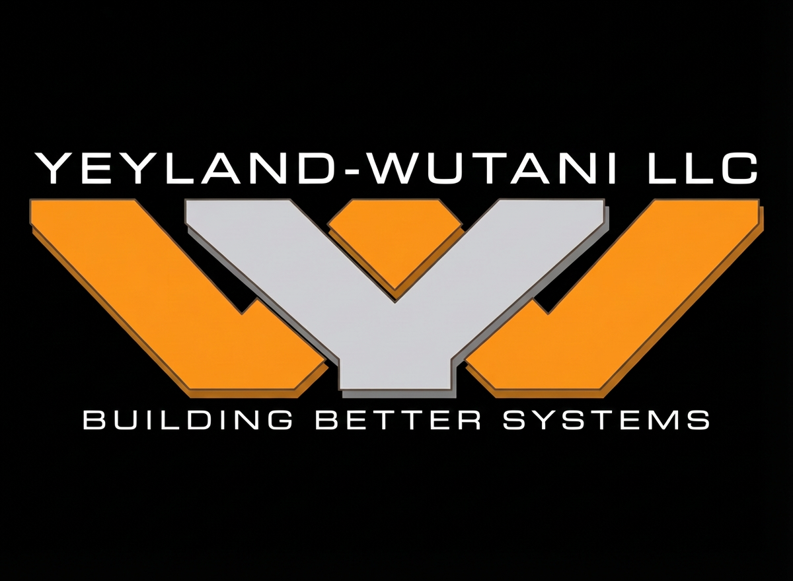

<div align="center">



# Yeyland Wutani LLC

**IT Consulting & Cybersecurity Services | Building Better Systems**

[](LICENSE)
[](https://docs.microsoft.com/powershell/)
[](https://www.microsoft.com/windows)

</div>

---

## Overview

Production-ready PowerShell tools and frameworks for enterprise IT administration, security hardening, and automation. Developed through real-world MSP engagements and designed for efficiency and security.

**Core Capabilities:**
- Infrastructure & Cloud management
- Security assessment and incident response
- Active Directory and hybrid identity
- Network discovery and monitoring
- Automation and deployment

---

## Repository Structure

```
YeylandWutani/
├── ActiveDirectory/     # AD health, troubleshooting, DFSR recovery
├── Automation/          # Cleanup, file management, conversions
├── Monitoring/          # System health, disk, service monitoring
├── Network/             # Discovery, connectivity testing
└── Security/            # M365 security, SharePoint auditing
```

---

## Requirements

- PowerShell 5.1+ (7+ recommended)
- Windows Server 2016+ or Windows 10/11
- Administrative privileges as needed
- Module dependencies documented per script

---

## Usage

All scripts include inline help:

```powershell
Get-Help .\ScriptName.ps1 -Full
```

Scripts follow PowerShell best practices with parameter validation, WhatIf support, and comprehensive error handling.

---

## Security Notice

These tools are for authorized IT administration and security testing only. Test in non-production environments first. Yeyland Wutani LLC assumes no liability for misuse.

---

## License

MIT License. See [LICENSE](LICENSE) for terms. Commercial support available.

---

## Support This Project

[](https://www.paypal.com/donate/?hosted_button_id=NAWYL36KNZHGE)

---

## Contact

**Yeyland Wutani LLC**  
Email: [Yeyland.Wutani@tcpip.network](mailto:Yeyland.Wutani@tcpip.network)

---

<div align="center">

**Building Better Systems**

</div>
